  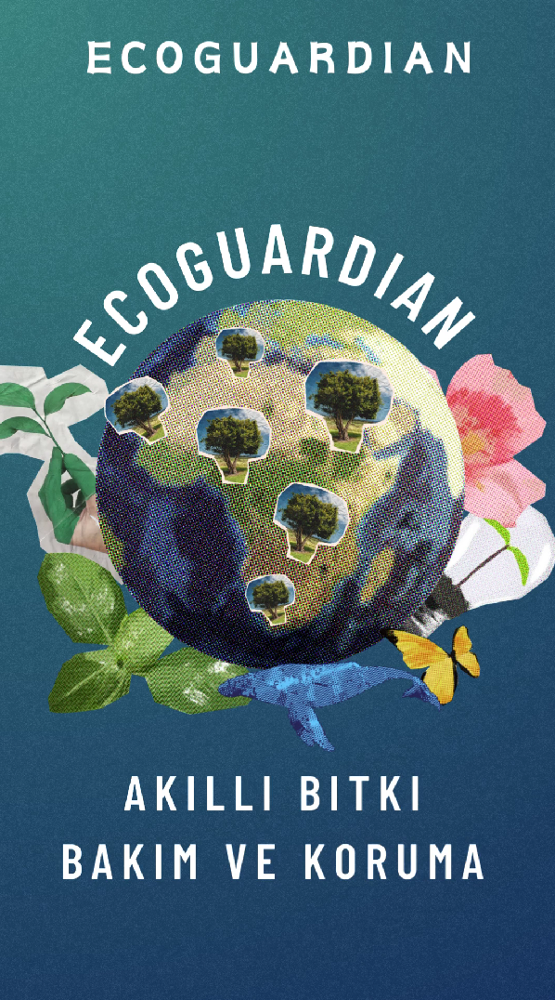

  # Ekip ve Proje İsmi

  ### **`EcoGuardian`**

  # Ekip ve Ürün Hakkında Bilgiler

  ## Takım Üyeleri

  <table>
    <tr>
      <th></th>
      <th>İsim</th>
      <th>Başlık</th>
      <th>İletişim</th>
    </tr>
    <tr>
      <td>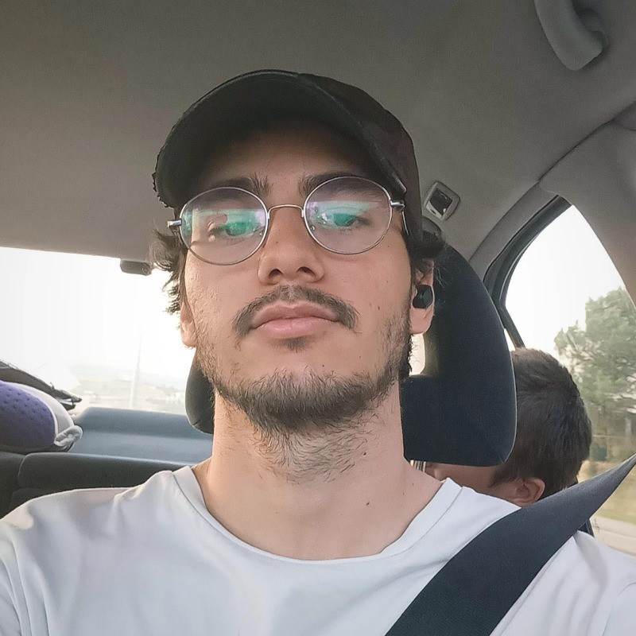</td>
      <td>Besat Arif Çıngar</td>
      <td>Product Owner</td>
      <td>
        
      </td>
    </tr>
    <tr>
      <td></td>
      <td>Berin Irmak Arıkboğa</td>
      <td>Scrum Master</td>
      <td>
        
      </td>
    </tr>
    <tr>
      <td>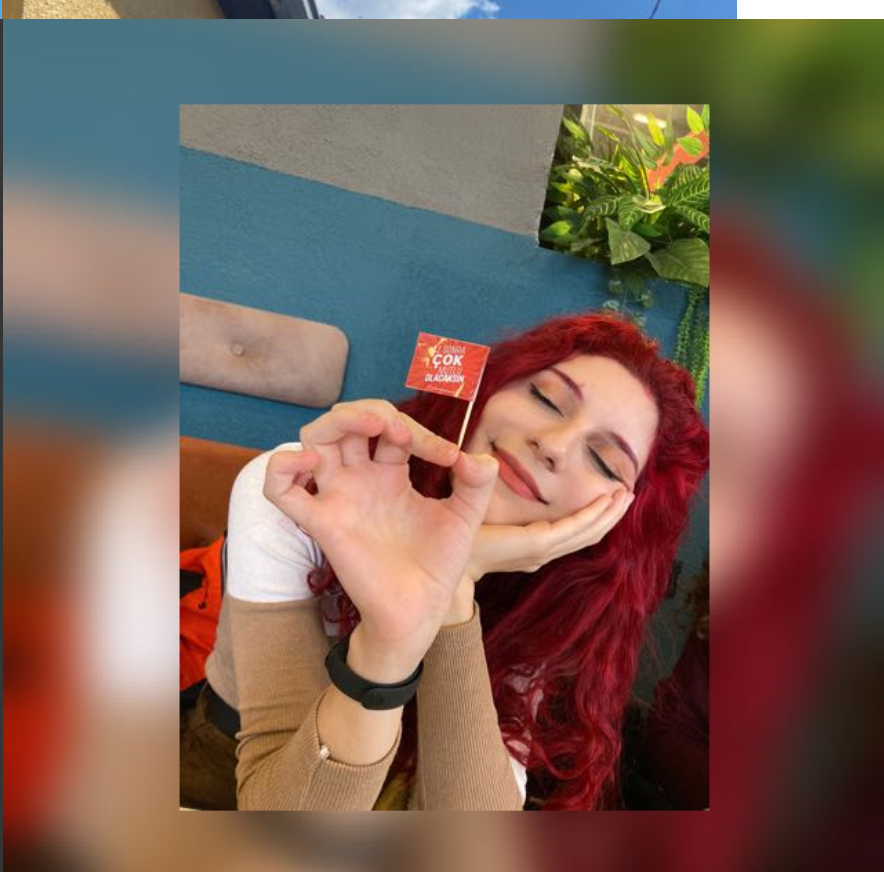</td>
      <td>Berivan Dağcı</td>
      <td>Developer</td>
      <td>
        
      </td>
    </tr>
    <tr>
      <td>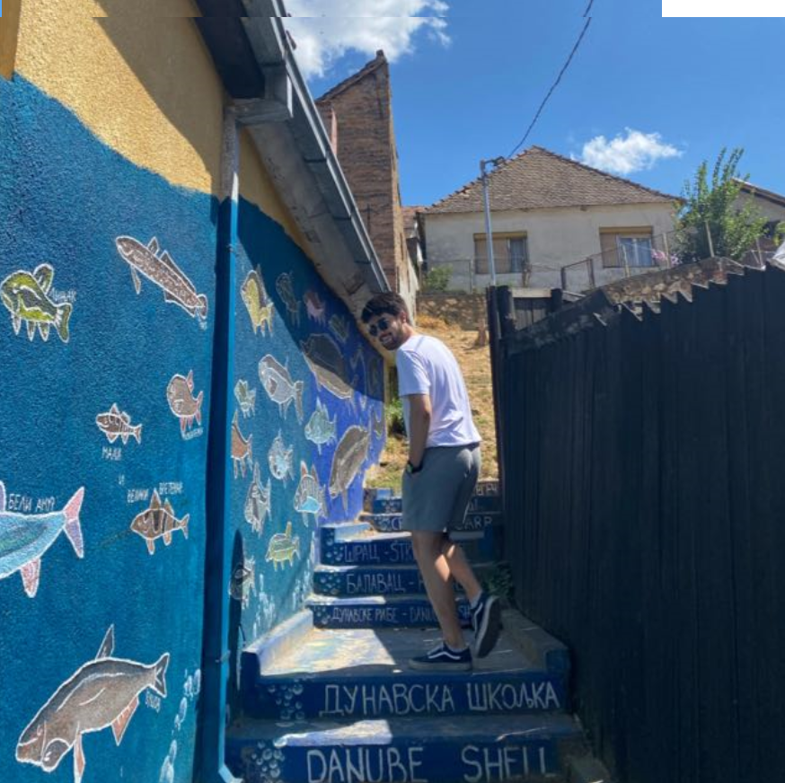</td>
      <td>Bilal Enes Söylemez</td>
      <td>Developer</td>
      <td>
        
      </td>
    </tr>
    <tr>
      <td>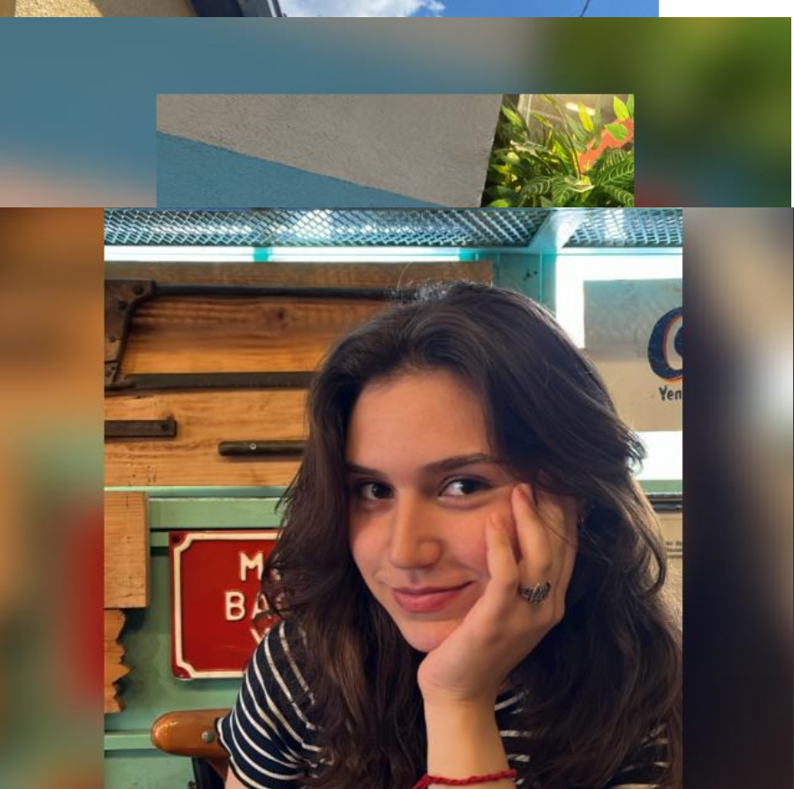</td>
      <td>Azra Ece Güney</td>
      <td>Developer</td>
      <td>
       
      </td>
    </tr>
   
  </table>

  --- 

  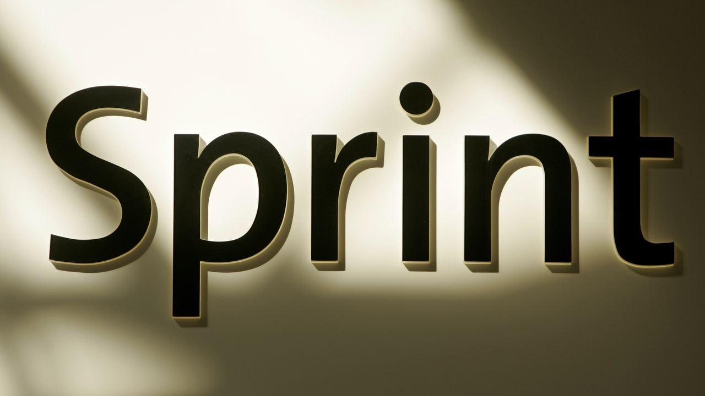

  

    
<h1>Sprint 1</h1>

  

    
<h3>Sprint 1 - Malzemeler</h3>

  <table style="width: 100%;">
    <tr>
      <td colspan="4" style="text-align: center;"><h2>ESP8266 WiFi bağlantısı sağlayan, mikrodenetleyici içeren ve geniş bir IoT uygulama yelpazesinde kullanılabilen bir entegre devredir. Bizlerde bu amaçla kullanacağız.</h2></td>
    </tr>
    <tr>
      <td style="width: 25%;">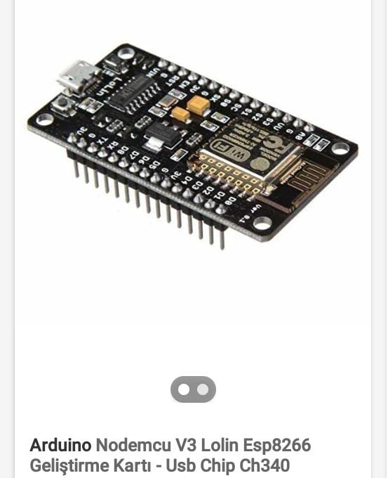</td>
    </tr>
    <tr>
      <td colspan="4" style="text-align: center;"><h2>Bu sensörler ve daha pek çokları, ESP8266 platformu üzerinde çalışacak şekilde entegre edilebilir. Sensör verilerini ESP8266 üzerinde işleyerek, internete gönderebilir veya yerel ağ üzerinde diğer cihazlarla paylaşabilirsiniz. Bu da ESP8266'nın geniş bir uygulama yelpazesi ve esneklik sağlayan önemli bir özelliğidir. Bizim şuanlık aklımızdaki sensörler bunlar. 3 sensörüde denedik çalışıyor Fakat Fakat 3 sensor yerine 2 kullanmanın daha mantıklı olacağını düşünüyoruz. hangisi ile ilerleyebiliriz toplantılarımızdan sonra karar vereceğiz.</h2></td>
    </tr>
    <tr>
      <td style="width: 25%;">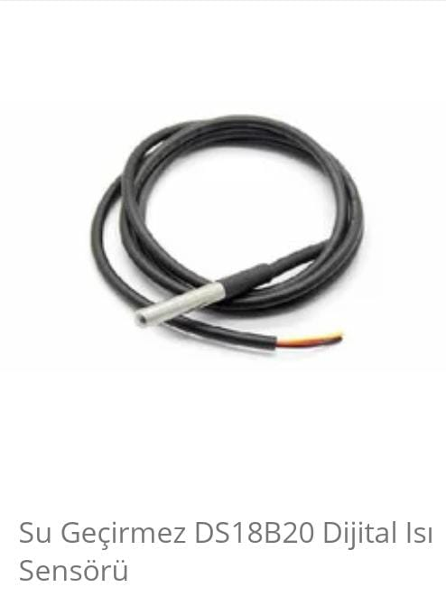</td>
      <td style="width: 25%;">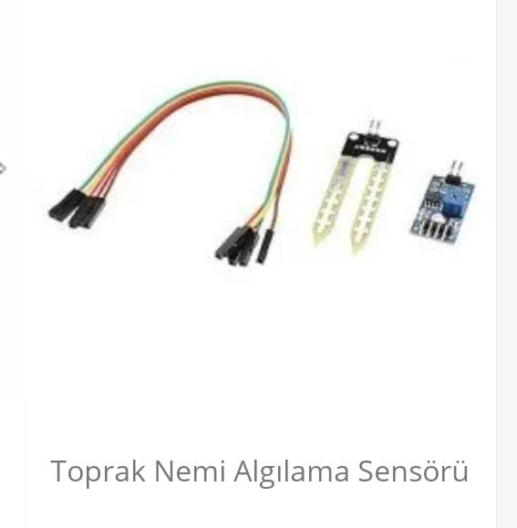</td>
      <td style="width: 25%;">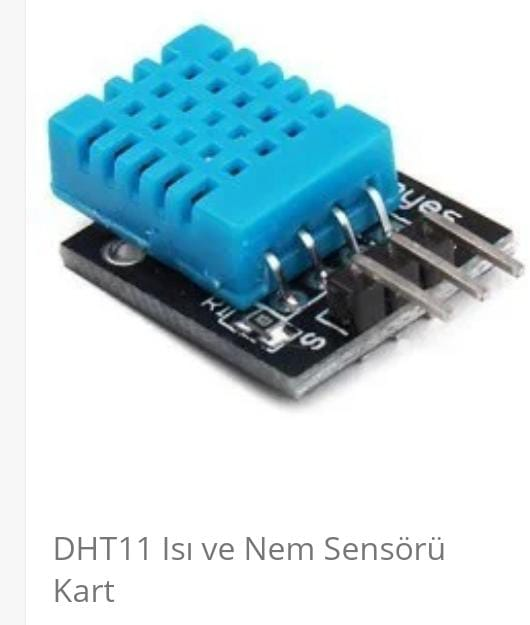</td>
    </tr>
    <tr>
      <td colspan="4" style="text-align: center;"><h2>Örnek Olarak Diğer Malzemler</h2></td>
    </tr>
    <tr>
      <td style="width: 25%;">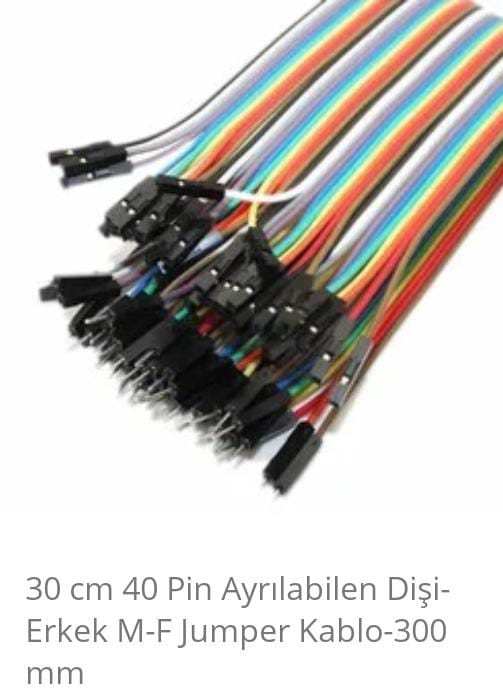</td>
      <td style="width: 25%;">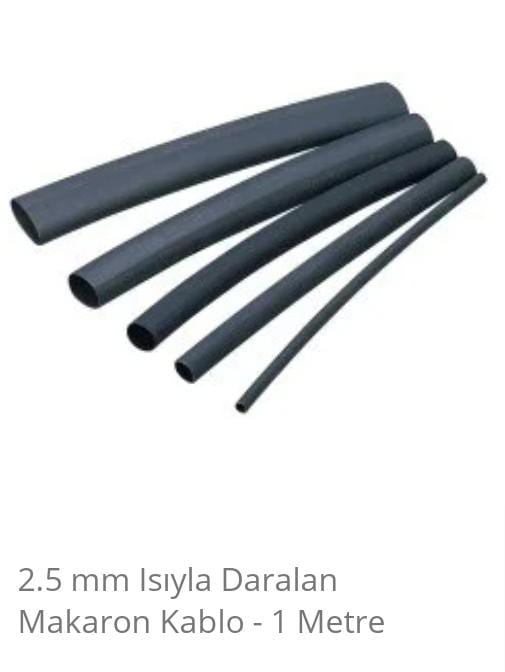</td>
    </tr>

  </table>
  
   

  

    
<h3>Sprint 1 - Sprint Board Update Screenshots</h3>

    
    
    
    
    
    
  

  

    
<h3>Sprint 1 - Burndown Chart</h3>

    
    
  

  - **Sprint Notes**:
    - It has been decided to use `Trello` for project management.

    - It has been decided to use `Figma` for UI designs.

    - It has been decided to use `Riverpod` for state management.

    - The `MVVM` structure has been set up and it will be proceeded on this basis.

    - It has been decided to use `Firebase` for the backend, and the `GetX` system for the page routing system.

    - It was decided to use `email login` for the login system.

    - It was decided to perform `identity verification` following the login system.

    - It has been decided to use `Hive` as the local database.
  - **Expected point completion within Sprint**: 200 points
  - **Point Completion Logic**: `(205 points completed)` The first sprint has a target of 200 points, the second sprint 100 points, and the third sprint 200 points. A lower point target has been set for the second sprint since there is a national holiday in Turkey during this period and all team members are residing in Turkey.
  - **Daily Scrum**: See file
  - **Product Backlog URL:** Click for Backlog (Trello)
  - **Sprint Review:**
    - Arda and Burak carried out a coordinated effort for the backend and frontend. We have agreed within the team to continue this way in the next sprint.

    - We struggled to decide on an application name for a while. We transitioned from 'zaten' to 'zaten' and took another step towards branding by purchasing the 'zaten.app' domain for the name.

    - The two biggest problems we encountered in this sprint were difficulty in deciding on a color palette and not having completed the logo yet.

    - We learned that the FloatingActionButton usage in the BottomNavigationBar and the notched feature of the navigation bar have been removed in Material 3, we overcame this issue by designing it ourselves.

    - Overall, we believe we had a good sprint process. We experienced a sprint process close to what we planned.

  - **Sprint Review Participants:** `Burak Taha Cevheroğlu`, `Arda Demirel`, `Dila Hazal Bilgin`, `Merve Ağaçayak`, `Onur Konuk`
  - **Sprint Retrospective:**
    - In the second sprint, it was decided in the team meeting that only Arda and Burak would write code for mobile.

    - In the second sprint, we decided to write our own API (for location information).

    - We had to postpone the logo design to the second sprint. We will continue with the design.

    - We will continue to develop the local database system (Hive).

    - As Burak and Arda will continue more with software related tasks, much of the project management has been delegated to the remaining team members.

    - In the second sprint, we will start writing a website for the zaten.app domain we bought for brand recognition. This task has been handed over to Onur.

    - It was decided to establish a review system before the product goes live during the second sprint.

    - For brand recognition and marketing purposes, it was decided to open an Instagram account during the second sprint.

    - In addition to email authentication, it was decided to add the Google auth system in the second sprint.

    - It was decided to add test AdMobs in the second sprint.

    - We decided to start localization and the first languages will be English and Turkish.

    - It was decided to add a user-to-user SDK with the Stream Chat SDK in the second sprint.

  - **Other Notes**:
  

    
<h3>Additional Files</h3>

    <ul>
      <li><strong>Project Scope And Goals:</strong> <a href="./bootcampFiles/sprintOne/projectscopeandgoals.pdf">See file</a></li>
      <li><strong>Target Audience:</strong> <a href="./bootcampFiles/sprintOne/targetaudience.pdf">See file</a></li>
      <li><strong>Conversations:</strong> See file</li>
    </ul>
  

  

  ---
