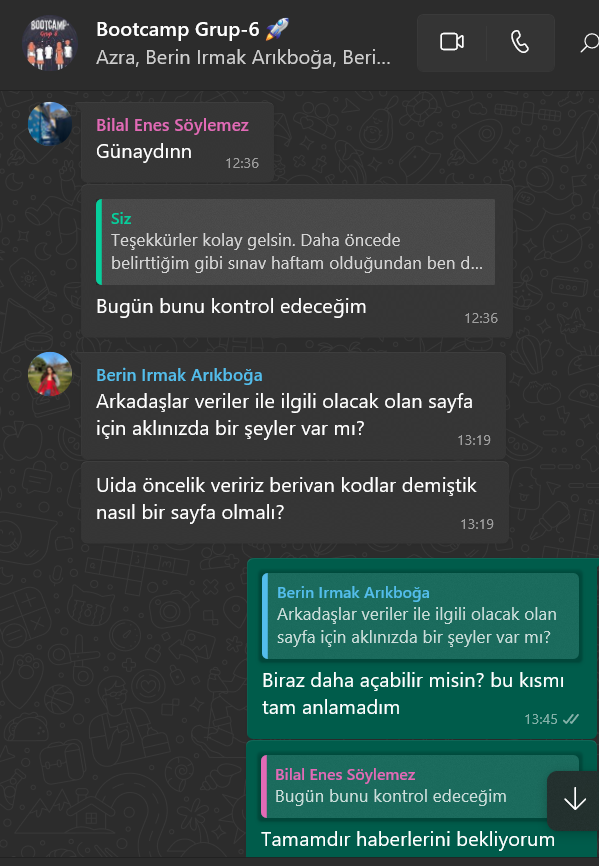
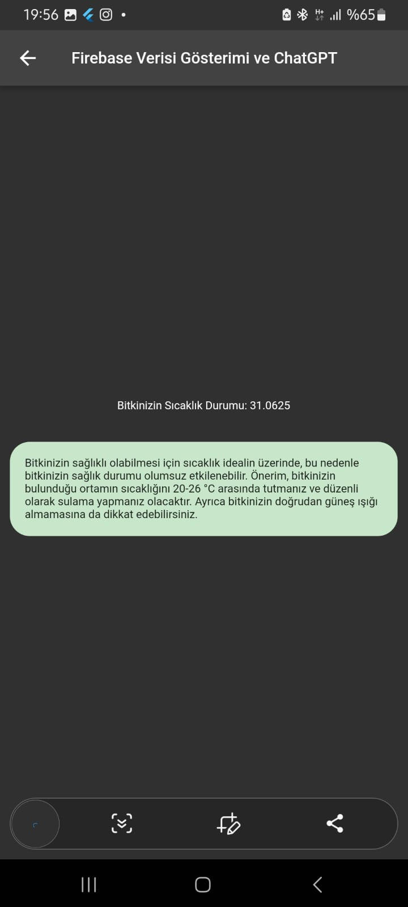
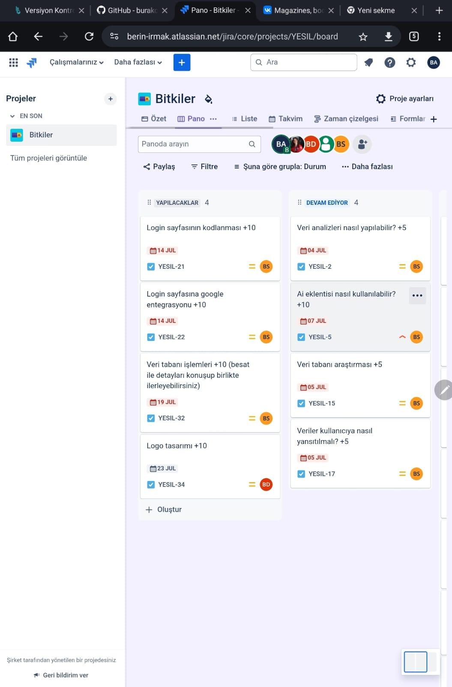

  

  # Ekip ve Proje İsmi

  ### **`EcoGuardian`**

  # Ekip ve Ürün Hakkında Bilgiler

  ## Takım Üyeleri

  <table>
    <tr>
      <th></th>
      <th>İsim</th>
      <th>Başlık</th>
      <th>İletişim</th>
    </tr>
    <tr>
      <td></td>
      <td>Besat Arif Çıngar</td>
      <td>Product Owner</td>
      <td>
        
      </td>
    </tr>
    <tr>
      <td></td>
      <td>Berin Irmak Arıkboğa</td>
      <td>Scrum Master</td>
      <td>
        
      </td>
    </tr>
    <tr>
      <td></td>
      <td>Berivan Dağcı</td>
      <td>Developer</td>
      <td>
        
      </td>
    </tr>
    <tr>
      <td></td>
      <td>Bilal Enes Söylemez</td>
      <td>Developer</td>
      <td>
        
      </td>
    </tr>
    <tr>
      <td></td>
      <td>Azra Ece Güney</td>
      <td>Developer</td>
      <td>
       
      </td>
    </tr>
   
  </table>

<h1>Proje Tanıtımı ve İşleyişi</h1>

    
<h3>•	Giriş</h3>

İlk proje için belirli bir alan gerekli. Bunun için büyük bir alan yerine küçük bir alandan başlamak ve ardından büyüyen ağaç mantığında ilerlemek istedik. Bildiğiniz gibi, AVL ağaç mantığında üstsel bir yapı düşündük. Projemizi yaparken ilk olarak sorunları tespit etmemiz gerekti. Günümüz sorunlarından bazıları şunlardır:

-	Sağlıksız gıda
-	Ürünlerin kuraklıktan zarar görmesi ve yok olması
-	Bozulan dünya ikliminde oluşan aşırı sıcaklık ve kuraklık
-	Bilinçsiz davranışlar nedeniyle (çevreyi kirletme, yangınlar) bitkilerin zarar görmesi

Bu sorunlara ek olarak Bilgisiz veya kontrolsüz yapılan yetiştirmeleri ekleyebiliriz. Projemiz nedir ve işleyişi...

    
<h3>•	Proje İşleyişi</h3>

Projemizde ilk olarak bir bitkinin olduğunu varsayalım. Şimdi asıl soruya geçelim: Bu bitkinin sağlıklı kalmasını nasıl sağlayabiliriz?

<h3>1.	Adım: Sensör Kullanımı</h3>
Sensörler ortamın ve toprağın durumunu analiz edebilir. Bu analizler sayesinde bitkinin ihtiyaçlarını belirlemek mümkündür.

<h3>2.	Adım: Analiz ve Algoritmalar</h3>
Sensörlerden gelen verilerin bir sonuca varması gereklidir. Geliştirdiğimiz algoritmalar ve grafikler sayesinde bilgilendirmeler yapabilir ve erken önlemler alabiliriz. Örneğin, toprak kuruluğu belirli bir seviyenin altına düşerse, otomatik olarak devreye giren sulama sistemi gibi. Erken uyarı kullanıcıya bildirilir ve kullanıcı buna karşın önlem alır.

<h3>3.	Adım: Uygulama Geliştirme</h3>
Bir uygulamaya ihtiyacımız var. Bu nedenle Flutter kullanarak bir uygulama yazıyoruz. Ancak, sensörlerden ölçülen verileri Flutter uygulamasında nasıl kontrol edebiliriz? İşte burada veri tabanı devreye girer. Arduino kısmında WiFi kartlı bir sistem kullanarak verileri veri tabanına yollayabiliriz. Bu noktada ESP8266 kullanabiliriz. ESP8266, uzaktan kontrollü sistemler için kullanılan, WiFi bağlanabilen ve internet üzerinden veri yollayabilen bir modüldür.

<h3>4.	Adım: Verilerin İşlenmesi</h3>
ESP8266 devresi almak, Arduino kısmında Firebase ve sensörler ile ilgili kütüphaneleri yüklemek ve verileri Firebase veri tabanına yollamak gereklidir. Verileri Firebase'den çekerek Flutter uygulamamızda işleyebiliriz. Ardından, Flutter uygulamasından veri tabanına veri yollayarak ESP8266 ile bu verileri çekip işlemler yapabiliriz (örneğin su dökme, ışık kontrolleri gibi).

<h3>5.	Adım: Algoritma ve Yapay Zeka Kullanımı</h3>
Kullanıcıya özgü işlemler yapmak için algoritmalar oluşturmak gereklidir. Birkaç analiz için algoritmalar oluşturduk fakat analiz için yapay zekayı da dahil ettik. Yapay zeka, verilerin analizi ve tavsiyeler için kullanılacaktır. Ayrıca, hava durumu sistemini de entegre ederek bulunduğu yerin hava durumunu analiz edip erken uyarılar verebiliriz.

    
<h3>•	Özet</h3>

<h3>Bu proje,</h3> sensörler, veri tabanları, yapay zeka ve hava durumu sistemleri gibi farklı teknolojileri bir araya getirerek bitkilerin sağlıklı kalmasını sağlamayı hedeflemektedir.
 
Bu proje, sadece ekinler için değil, bahçemizdeki küçük bir alan veya evdeki saksılar için de kullanılabilir. Bu sayede her alanda uygulama imkanı sunmaktadır.

Hedef kitle bu sayede belirlenmiş olur.

  --- 

  

  

    
<h1>Sprint 1</h1>

  

    
<h3>Sprint 1 - Malzemeler</h3>

  <table style="width: 100%;">
    <tr>
      <td colspan="4" style="text-align: center;"><h2>ESP8266 WiFi bağlantısı sağlayan, mikrodenetleyici içeren ve geniş bir IoT uygulama yelpazesinde kullanılabilen bir entegre devredir. Bizlerde bu amaçla kullanacağız.</h2></td>
    </tr>
    <tr>
      <td style="width: 25%;"></td>
    </tr>
    <tr>
      <td colspan="4" style="text-align: center;"><h2>Bu sensörler ve daha pek çokları, ESP8266 platformu üzerinde çalışacak şekilde entegre edilebilir. Sensör verilerini ESP8266 üzerinde işleyerek, internete gönderebilir veya yerel ağ üzerinde diğer cihazlarla paylaşabilirsiniz. Bu da ESP8266'nın geniş bir uygulama yelpazesi ve esneklik sağlayan önemli bir özelliğidir. Bizim şuanlık aklımızdaki sensörler bunlar. 3 sensörüde denedik çalışıyor Fakat Fakat 3 sensor yerine 2 kullanmanın daha mantıklı olacağını düşünüyoruz. hangisi ile ilerleyebiliriz toplantılarımızdan sonra karar vereceğiz.</h2></td>
    </tr>
    <tr>
      <td style="width: 25%;"></td>
      <td style="width: 25%;"></td>
      <td style="width: 25%;"></td>
    </tr>
    <tr>
      <td colspan="4" style="text-align: center;"><h2>Örnek Olarak Diğer Malzemler</h2></td>
    </tr>
    <tr>
      <td style="width: 25%;"></td>
      <td style="width: 25%;"></td>
    </tr>
 
  </table>
   
 
 

<!--  uygulama için altı -->

  

    
<h3>Sprint 1 - Arduino ve Uygulama İçinden Görseller</h3>

  <table style="width: 100%;">
    <tr>
      <td colspan="4" style="text-align: center;"><h2>Sıcaklık ve Nem Verisinin Arduino (esp8266) ile firebase veri yollama kısmı</h2></td>
    </tr>
    <tr>
      <td style="width: 25%;">
        
  
</td>
    </tr>
    <tr>
      <td colspan="4" style="text-align: center;"><h2>Sensor ölçümlerini kod içinde kullanımı ve ayarlanması.</h2></td>
    </tr>
    <tr>
      <td style="width: 25%;">
        
  
</td>
    </tr>
       <tr>
      <td colspan="4" style="text-align: center;"><h2>Uygulama Ölçülen verilerin Değerlerini Veritabanından Çekip ekranda gösterme</h2></td>
    </tr>
    <tr>
      <td style="width: 25%;"></td>
    </tr>
    <tr>
      <td colspan="4" style="text-align: center;"><h2>Sıcaklık ve Nem değerlerinin geçmiş takibi ve analizi</h2></td>
    </tr>
    <tr>
      <td style="width: 25%;"></td>
        <td style="width: 25%;"></td>
    </tr>
 <tr>
      <td colspan="4" style="text-align: center;"><h2>Kayıt Edilen Verilerin Verileri ve Grafikleri</h2></td>
    </tr>
    <tr>
      <td style="width: 25%;"></td>
        <td style="width: 25%;"></td>
      <td style="width: 25%;"></td>
    </tr>
 
  </table>
   

<!-- uygulama son -->

  

    
<h3>Sprint 1 - Sprint Panosu Güncelleme Ekran Görüntüleri</h3>

    
   
    
    
    
    
    
    
    
  

  
 

    
<h3>Sprint 1 - Devreler ve Deneme Aşamaları - Ek Görseller</h3>

    
    
       
      
       
       
  

  - **Sprint Notları**:
    - Proje yönetimi için `Jira` kullanılmasına karar verildi.

    - UI tasarımlarında `Figma` kullanılmasına karar verildi..

    - Durum yönetimi için  `Riverpod` kullanılmasına karar verildi.

    - `MVVM` yapısı kurulmuş olup, bu temelde ilerlenecektir.

    - Veri Tabanı için `Firebase` düşünüldü.

    - Giriş sistemi için `email login` kullanılmasına karar verildi.

    - Giriş sisteminin ardından  `kimlik doğrulama` yapılmasına karar verildi.

   
  - **Sprint içinde beklenen Puan tamamlama**: 145 Puan 
  - **Puan Tamamlama Mantığı**: `(95 kısmi olarak tamamlandı)` İlk sprintin hedefi 145 puan. Okullarımızda sınav dönemi olması ve takım üyelerinin çoğunun sınavlarının olması nedeniyle ilk sprint için daha düşük puan hedefi belirlendi ve bu durumun telafisi olarak B planı hazırlandı.
  - **Daily Scrum**: Dosyaya bakın
  - **Ürün İş Listesi URL'si:** İş Listesi için tıklayın <a href="https://berin-irmak.atlassian.net/jira/core/projects/YESIL/board">(Jira)</a>
  - **Sprint Review:**
    - Besat, Bilal, Berivan, arka yüz(backend) ve ön yüz (frontend) için koordineli bir çaba yürüttüler. Ekip içinde bir sonraki sprintte bu şekilde devam etme konusunda anlaştık.

     - Uİ/Ux Design kısmında Berin ve Azra'nın devam etmesinde anlaştık.

    - Bir süre uygulama adı konusunda karar vermekte zorlandık. 'bitkim'den 'FloraNabız'e geçtik ve isim için en son 'EcoGuardian: Akıllı Bitki Bakım ve Koruma' olarak kararkıldık bu konuda önemli adım daha atmış olduk.

    - Bu sprintte karşılaştığımız en büyük iki sorun Tasarım ve Esp8266 ile firebase ilişkisidi.

    - Arduino Kısmında Firebase kütüphanelerinde sorun ile karşılaştık fakat uzun uğraş ve araştırmalarımız doğruştutunsa kod geliştirdik. Bir kaç düzeltme ve çaba ile bunun üstesinden geldik.

    -Genel olarak, iyi bir sprint süreci geçirdiğimize inanıyoruz. Planladığımıza yakın bir sprint süreci yaşadık Belirttiğimiz gibi Sınav haftalarımız olduğundan ekipçe tam bir ilerleyiş için ilk sprint puanımızı düşük tuttuk.
   

  - **Sprint Review Participants:** `Besat Arif Çıngar`, `Berin Irmak Arıkboğa`, `Berivan Dağcı`, `Azra Ece`, `Bilal Enes Söylemez`
  - **Sprint Retrospective:**
    - Mobil Kısmında Besat, Bilal ve Berivan'ın devam etmesine karar verdik.

    - Uİ/Ux Design kısmında Berin ve Azra'nın devam etmesine karar verdik.

    - İsim kısmını yeni sprintte netleştirmek için çalışmalara başladık.

    - uygulama kısmında yapay zeka entegresi ve verilerin analizini ana hedeflerimiz arasına aldık.

    - esp8266 kullanarak yaptığımız projenin tamamen devresinin oluşturulmasını yetişme durumuna göre tasarımın (Örnek Ürün) bitmesini hedefledik.

    - firebase kısmında daha derin araştırma ve incelenmesini kararkaştırdık.

    - Esp8266 Kısmında su dökme ve bunun kontrollü gibi işlemleri oluşturmak için algoritma oluşturmaya karar aldık.

    - Flutter Kısmında esp8266 kısmından yolladığımız verilerin Daha işlevli kullanılması ve entegre kısmının güçlendirilmesini karar aldık.

    - Tasarımın modernleşmesi ve kullanıcı odağının yüksek olması için daha modern tasarım oluşturmak için incelemeler başlattık.

    - E-posta kimlik doğrulamasının yanı sıra ikinci sprintte Google kimlik doğrulama sisteminin eklenmesine karar verildi.

  - **Diğer Notlar**:
  

    
<h3>Ek Dosyalar</h3>

    <ul>
      <li><strong>Proje Kapsamı ve Hedefleri</strong> <a href="./bootcampFiles/sprint_1/Proje Tanıtımı ve İşleyişi.pdf">Dosyayı İncele</a></li>
   ><h3>•	Özet ve Hedef Kitle</h3>

<h3>Bu proje,</h3> Sensörler, veri tabanları, yapay zeka ve hava durumu sistemleri gibi farklı teknolojileri bir araya getirerek bitkilerin sağlıklı kalmasını sağlamayı hedeflemektedir.
 
Bu proje, sadece ekinler için değil, bahçemizdeki küçük bir alan veya evdeki saksılar için de kullanılabilir. Bu sayede her alanda uygulama imkanı sunmaktadır.

Hedef kitle bu sayede belirlenmiş olur.

 <li><strong>Konuşmalar</strong> Yukarıda Paylaşıldı</li>
    </ul>
  

  

  ---

  
  

    
<h1>Sprint 2</h1>

  

    
<h3>Sprint 2 - Ürün ve Devre kısmı tamamlandı [Arduino - Esp8266]</h3>

  <table style="width: 100%;">
    <tr>
      <td colspan="4" style="text-align: center;"><h2>Oluşturulan projede esp8266, sıcaklık, nem sensorleri ek olarak RGB led ve DC su pompası yer almaktadır. Bir bitkinin ihtiyacı olan her türlü işlem düşünülmüştür.</h2></td>
    </tr>
    <tr>
      <td style="width: 25%;"></td>
       <td style="width: 25%;"></td>
         <td style="width: 25%;"></td>
       <td style="width: 25%;"></td>
         <td style="width: 25%;"></td>
    </tr>
    
      
  
 
  
 
  </table>
   
 
 

<!--  uygulama için altı -->

  

    
<h3>Sprint 2 - Mobil kısmı. Bu sprintte yeni eklenen sayfaların Ekran Görüntüsü var.</h3>

  <table style="width: 100%;">
    <tr>
      <td colspan="4" style="text-align: center;"><h2>Yapay zeka ile bitkinin verisi entegrasyonu. Yapay zeka bitki verilerine göre yorum ve analizde bulunup öneri veriyor.</h2></td>
    </tr>
    <tr>
     <td style="width: 25%;"></td>
        <td style="width: 25%;"></td>
        <td style="width: 25%;"></td>
    </tr>
 
   
   
 

   
 
  </table>
   

<!-- uygulama son -->

  

    
<h3>Sprint 2 - Sprint Panosu Güncelleme Ekran Görüntüleri</h3>

    
   
    
    
    
    
    
    
    
        
        
        
       
  

  
 

    
<h3>Sprint 2 - UI Tasarım</h3>

    
    
       

       
  

  

  - **Sprint Notları**:
    - Yapay zeka entegeresi için `Openai` kullanılmasına karar verildi.

    - UI tasarımlarında `Figma` kullanıldı.

    - Uygulama Menü Tasarımı Değişti  `Yeşil` Renk kullanılmasına karar verildi.

    - Uygulama ismi olarak `EcoGuardian` karar verildi.

    - Veri Tabanı için `Firebase` kısmında ilerlendi.

    - Arduino için `ESP8266` kullanılmasına karar verildi.

    - ESP8266 ile uyumlu  `sensorler` kararlaştırıldı.

   
  - **Sprint içinde beklenen Puan tamamlama**: 170 Puan 
  - **Puan Tamamlama Mantığı**: `(150 kısmi olarak tamamlandı)` İlk sprintin hedefi 145 puan, ikinci sprintin 170 puan. Okullarımızda sınav dönemi olması ve takım üyelerinin çoğunun sınavlarının olması nedeniyle ilk sprint için daha düşük puan hedefi belirlendi ve bu durumun telafisi olarak B planı hazırlanmıştı. İkinci sprint için ise bazı ekip arkadaşlarımızın projeye ilerleme konusunda yaşanılan aksaklıklar tarafından beklenenden kısmı şekilde az gerçekleşti. Bu durum için düzeltme planları hazırlandı ve uygulanmaya koyuldu.
  - **Daily Scrum**: Dosyaya bakın
  - **Ürün İş Listesi URL'si:** İş Listesi için tıklayın <a href="https://berin-irmak.atlassian.net/jira/core/projects/YESIL/board">(Jira)</a>
  - **Sprint Review:**
    - Besat, arka yüz(backend) ve ön yüz (frontend) için koordineli bir çaba yürüttü. Ekip içinde bir sonraki sprintte bu şekilde devam etme konusunda anlaşıldı.

     - Uİ/Ux Design kısmında Berin ve Azra'nın devam etmesinde anlaştık.

    - Bir süre uygulama adı konusunda karar vermekte zorlandık. 'bitkim'den 'FloraNabız'e geçtik ve isim için en son 'EcoGuardian: Akıllı Bitki Bakım ve Koruma' olarak kararkıldık bu konuda önemli adım daha atmış olduk.

    - Bu sprintte karşılaştığımız en büyük iki sorun Tasarım ve Esp8266 ile firebase ilişkisidi.

    - Arduino Kısmında Firebase kütüphanelerinde sorun ile karşılaştık fakat uzun uğraş ve araştırmalarımız doğruştutunsa kod geliştirdik. Bir kaç düzeltme ve çaba ile bunun üstesinden geldik.

    -Genel olarak, iyi bir sprint süreci geçirdiğimize inanıyoruz. Planladığımıza yakın bir sprint süreci yaşadık Belirttiğimiz gibi Sınav haftalarımız olduğundan ekipçe tam bir ilerleyiş için ilk sprint puanımızı düşük tuttuk.
   

  - **Sprint Review Participants:** `Besat Arif Çıngar`, `Berin Irmak Arıkboğa`, `Berivan Dağcı`, `Azra Ece`, `Bilal Enes Söylemez`
  - **Sprint Retrospective:**
    - Mobil Kısmında Besat, Bilal ve Berivan'ın devam etmesine karar verdik.

    - Uİ/Ux Design kısmında Berin ve Azra'nın devam etmesine karar verdik.

    - İsim kısmını yeni sprintte netleştirmek için çalışmalara başladık.

    - uygulama kısmında yapay zeka entegresi ve verilerin analizini ana hedeflerimiz arasına aldık.

    - esp8266 kullanarak yaptığımız projenin tamamen devresinin oluşturulmasını yetişme durumuna göre tasarımın (Örnek Ürün) bitmesini hedefledik.

    - firebase kısmında daha derin araştırma ve incelenmesini kararkaştırdık.

    - Esp8266 Kısmında su dökme ve bunun kontrollü gibi işlemleri oluşturmak için algoritma oluşturmaya karar aldık.

    - Flutter Kısmında esp8266 kısmından yolladığımız verilerin Daha işlevli kullanılması ve entegre kısmının güçlendirilmesini karar aldık.

    - Tasarımın modernleşmesi ve kullanıcı odağının yüksek olması için daha modern tasarım oluşturmak için incelemeler başlattık.

    - E-posta kimlik doğrulamasının yanı sıra ikinci sprintte Google kimlik doğrulama sisteminin eklenmesine karar verildi.

  - **Diğer Notlar**:
  

    
<h3>Ek Dosyalar</h3>

    <ul>
      <li><strong>Proje Kapsamı ve Hedefleri</strong> <a href="./bootcampFiles/sprint_1/Proje Tanıtımı ve İşleyişi.pdf">Dosyayı İncele</a></li>
   ><h3>•	Özet ve Hedef Kitle</h3>

<h3>Bu proje,</h3> Sensörler, veri tabanları, yapay zeka ve hava durumu sistemleri gibi farklı teknolojileri bir araya getirerek bitkilerin sağlıklı kalmasını sağlamayı hedeflemektedir.
 
Bu proje, sadece ekinler için değil, bahçemizdeki küçük bir alan veya evdeki saksılar için de kullanılabilir. Bu sayede her alanda uygulama imkanı sunmaktadır.

Hedef kitle bu sayede belirlenmiş olur.

 <li><strong>Konuşmalar</strong> Yukarıda Paylaşıldı</li>
    </ul>
  

  

  ---
